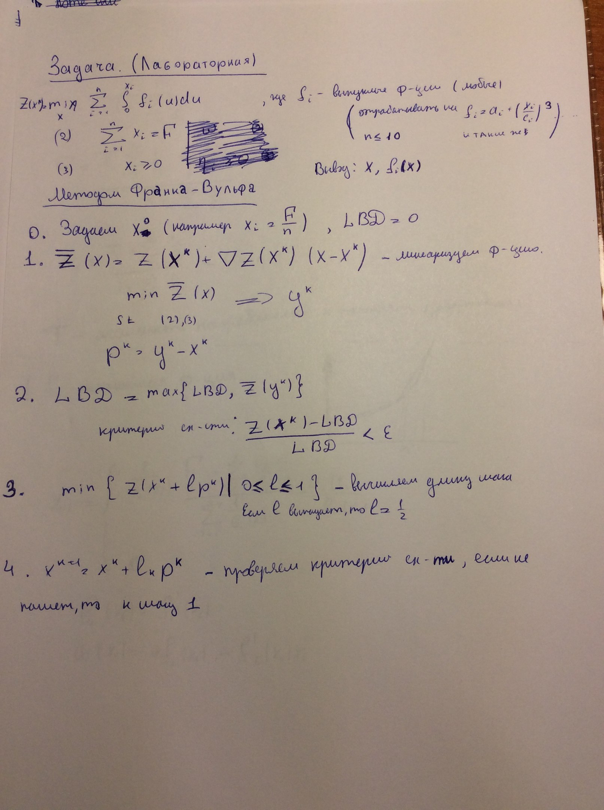

#Frank Wolfe implementation

These jupyter notebooks contain implementations of Frank-Wolfe algorithm described on lectures of docent Krylatov A.Y. on applied math department. 
"Frank Wolfe algorithm" notebook is self-explanatory inside :) 
You can find bellow explanation of how it works 
Hope someone would find it useful. 
To view this notebook better, go [here](http://nbviewer.jupyter.org/github/kuparez/social-economics-models-course/blob/master/transport-flow-algorithm/user_equilibrium.ipynb)

